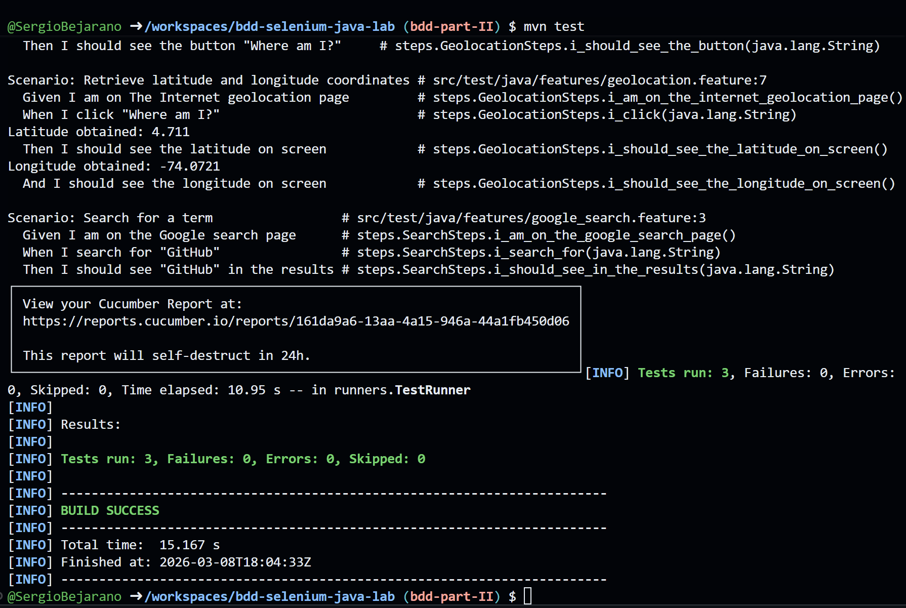
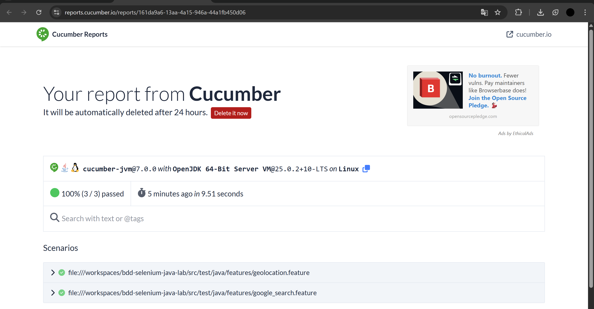
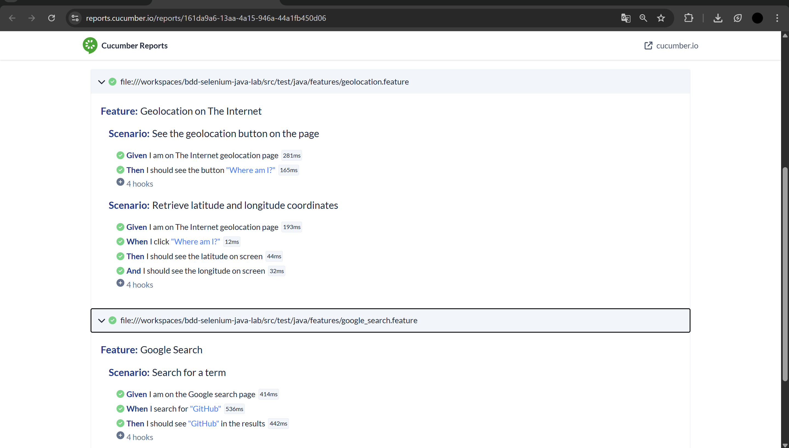

# bdd-selenium-java-lab

BDD automation testing project using Selenium WebDriver, ChromeDriver, Cucumber, and Java. Configured to run in GitHub Codespaces with Maven.

---

## New feature: Geolocation

The **Geolocation** feature was implemented using the test page [The Internet - Geolocation](https://the-internet.herokuapp.com/geolocation) as a guide.

This page allows obtaining the browser coordinates (latitude and longitude) via the browser's geolocation API (`navigator.geolocation`), and displays a link to Google Maps with the detected location.

### Pattern used: PageFactory

The implementation follows Selenium's **PageFactory** pattern, where page elements are declared with the `@FindBy` annotation and initialized with `PageFactory.initElements()`:

- `GeolocationPage.java` — Page Object containing the page elements and actions.
- `GeolocationSteps.java` — Step definitions that connect the Gherkin scenarios with the Page Object.
- `geolocation.feature` — Scenarios written in Gherkin language (English).

### Implemented scenarios

**Scenario 1: See the geolocation button**

```gherkin
Scenario: See the geolocation button on the page
  Given I am on The Internet geolocation page
  Then I should see the button "Where am I?"
```

Verifies that upon entering the page the main button is visible and has the correct text.

**Scenario 2: Retrieve latitude and longitude coordinates**

```gherkin
Scenario: Retrieve latitude and longitude coordinates
  Given I am on The Internet geolocation page
  When I click "Where am I?"
  Then I should see the latitude on screen
  And I should see the longitude on screen
```

Verifies that clicking the button displays latitude and longitude values on the screen.

### Technical note

Tests run in **headless** mode (without a graphical interface). Since Chrome in headless mode does not have access to GPS hardware, JavaScript is used to inject test coordinates (Bogotá, Colombia: `4.7110, -74.0721`) directly into the page's `showPosition()` function, simulating the result of a real geolocation.

---

## Running

```bash
mvn test
```

## Results





